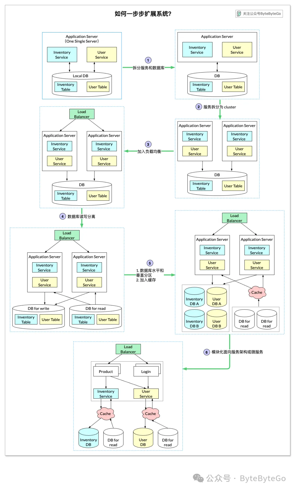

---

## 🎯 面试官问：“如果你的项目要支持百万用户，你会如何设计？”

> ✅ **关键词回答方向：性能优化 + 架构演进 + 分布式设计**

---

### ✅ 一、架构演进 6 步法（对照图片）

#### 🧱 Step 1：拆分应用与数据库
- 起步阶段：单体架构，应用与数据库部署在同一台机器；
- 扩展第一步：**将应用和数据库部署在不同服务器**，减轻资源竞争。

---

#### 🧱 Step 2：部署应用服务器集群
- 用户增长 → 单台应用服务器扛不住；
- **部署多个应用节点**，实现横向扩展（scale-out）。

---

#### 🧱 Step 3：加入负载均衡器
- **负载均衡器（如 Nginx、LVS、ELB）** 将请求分发到后端多个应用服务器；
- 实现请求均衡、高可用、容错能力。

---

#### 🧱 Step 4：数据库读写分离
- 数据库压力大时，读写分离是常用策略：
  - 主库负责写入；
  - 从库负责读取；
  - 提高数据库吞吐量。

---

#### 🧱 Step 5：数据库拆分和缓存优化
- **数据库仍是瓶颈？考虑以下方案：**
  - ⬆️ **垂直扩展（Scale-Up）**：提升单台数据库性能（CPU、内存）；
  - ➗ **水平拆分（Sharding）**：按业务或表拆成多个数据库（如按用户ID取模）；
  - ⚡ **引入缓存（Redis）**：减少数据库查询频率，加速响应。

---

#### 🧱 Step 6：拆分服务，转向微服务架构
- 将系统按照业务功能拆分成多个服务：
  - 如用户服务、库存服务、订单服务等；
  - 每个服务可独立部署、扩展、维护；
  - 支持更大规模用户和更灵活的迭代。

---

## 🚀 衍生优化点（加分点）

| 优化手段 | 说明 |
|----------|------|
| CDN | 静态资源放CDN边缘加速 |
| 异步化 | 使用消息队列（Kafka、RabbitMQ）解耦系统 |
| 限流熔断 | 限流防止雪崩，熔断保障核心服务稳定 |
| 分布式ID | 使用雪花算法/Leaf生成唯一订单ID |
| 服务注册发现 | 使用 Nacos / Eureka 管理微服务节点 |
| 容器化 | 用 Docker + K8s 部署，实现弹性伸缩 |

---

## 🧑‍💼 面试回答框架建议：

> “如果我们的系统要支持百万级用户，我会按阶段优化系统架构。首先将应用和数据库分离，其次部署应用集群并使用负载均衡器来分发请求。当数据库压力过大时，我会使用读写分离、引入缓存，以及数据库分库分表。最后，我会按功能拆分为微服务架构，提升可维护性与可扩展性，同时结合容器化和异步解耦机制来进一步增强系统弹性。”

---

## 🧠 面试官问：“你能背一下负载均衡算法吗？”

---

### ✅ 一、正向代理 vs 反向代理（基础概念复习）

| 概念 | 正向代理 | 反向代理 |
|------|----------|----------|
| 代理对象 | 客户端 | 服务器 |
| 客户端是否能看到真实服务器？ | ✅ 可以 | ❌ 不可以 |
| 应用场景 | 翻墙、隐藏用户身份、加速访问 | Nginx 代理服务器、负载均衡、隐藏服务 IP |
| 常见用途 | 科学上网、内容屏蔽 | 负载均衡、缓存静态资源、SSL 终端、防火墙 |

---

### ✅ 二、负载均衡作用

> **将请求平均或智能地分配到多个服务器节点上，提升吞吐、容错和可用性。**

应用场景：
- Web 服务部署（如 Nginx）
- 微服务网关
- CDN 边缘分发
- 网络流量控制与降级

---

### ✅ 三、常见负载均衡算法（6大类）🧮

#### 🔹 1. 静态算法（Simple & Rule-based）

| 算法 | 原理 | 特点 |
|------|------|------|
| **Round Robin（轮询）** | 请求按顺序分发 | 简单但不考虑性能差异 |
| **Sticky Round Robin（粘性轮询）** | 相同用户请求总分到同一节点 | 适合有状态服务 |
| **Weighted Round Robin（加权轮询）** | 设置不同服务器权重 | 权重大 → 分配请求多 |
| **Hash（IP/URL Hash）** | 对 IP 或 URL 进行哈希 | 相同请求始终到同一服务器，适合缓存策略 |

---

#### 🔹 2. 动态算法（性能感知型）

| 算法 | 原理 | 优点 |
|------|------|------|
| **Least Connections（最少连接）** | 分配给当前连接数最少的服务器 | 动态平衡压力 |
| **Least Time（最短响应时间）** | 分配给响应最快的服务器 | 精准控制延迟 |

---

### ✅ 四、实际面试中怎么回答？

#### 🎤 面试话术模板：
> “我们项目使用了 Nginx 实现反向代理和负载均衡，根据业务选择了不同的算法。静态算法如轮询适用于无状态服务，而粘性轮询和哈希适合有状态服务或用户一致性要求高的场景。动态算法如最少连接和最短响应时间更适合高并发环境，可以实时感知服务器负载情况，避免性能瓶颈。”

---
