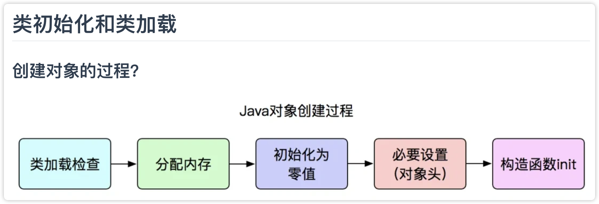
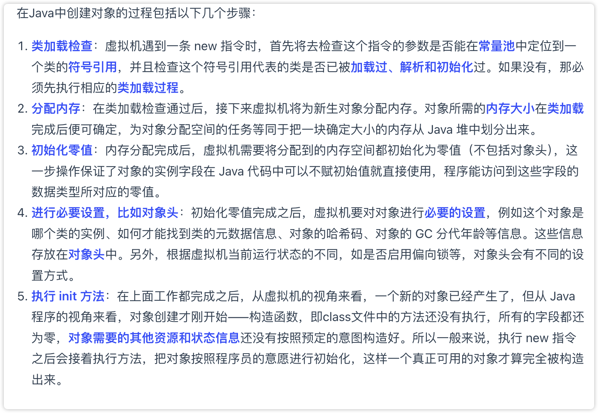

## 📚 JVM的内存结构总览

Java虚拟机（JVM）运行时的内存结构分为以下几个主要区域：

```
JVM运行时内存结构
├── 程序计数器（Program Counter Register）
├── Java虚拟机栈（Java Virtual Machine Stack）
├── 本地方法栈（Native Method Stack）
├── 堆（Heap）
└── 方法区（Method Area，JDK8后为元空间 Metaspace）
```

接下来我们逐个理解：

---

## ① 程序计数器（Program Counter Register）

- **作用**：
  - 指示当前线程正在执行的字节码指令的地址。
  - 类似于CPU中的PC寄存器。

- **特点**：
  - 每个线程都有独立的程序计数器，互不影响。
  - 唯一一个**不会抛出内存溢出（OutOfMemoryError）异常的内存区域**。

- **生命周期**：
  - 线程创建时建立，线程结束时销毁。

程序计数器就是用来**记录线程当前执行位置（具体是哪一条指令**的一个“小指针”。

简单来说：

程序计数器告诉JVM：“下一步要执行哪条指令了？”

可以把程序计数器想象成看书时用的书签

---

## ② Java虚拟机栈（JVM Stack）

- **作用**：
  - 描述Java方法执行的内存模型。
  - 每个方法调用对应一个“栈帧（Stack Frame）”，栈帧中包含：
    - 局部变量表（基本数据类型变量、对象引用变量）
    - 操作数栈（方法执行过程的中间计算结果）
    - 动态链接（指向方法区中的运行时常量池的方法引用）
    - 方法返回地址

- **特点**：
  - 每个线程都有独立的虚拟机栈。
  - 生命周期随线程而定。

- **可能出现的异常**：
  - `StackOverflowError`：栈深度超过JVM限制。
  - `OutOfMemoryError`：如果栈扩展时无法申请到足够内存。

示例：

```java
public void methodA() {
    int x = 10;         // 存在局部变量表中
    methodB();          // 创建新的栈帧
}
```

---

## ③ 本地方法栈（Native Method Stack）

- **作用**：
  - 与虚拟机栈功能相似，但为执行本地（Native）方法（如使用C或C++编写）服务。

- **特点**：
  - 每个线程也拥有一个独立的本地方法栈。
  - 生命周期随线程。

- **可能出现的异常**：
  - 与虚拟机栈一样：`StackOverflowError` 和 `OutOfMemoryError`。

示例：

```java
public native void nativeMethod(); // 声明native方法
```

---

## ④ 堆（Heap） ⭐⭐⭐ （重点）

- **作用**：
  - 存储程序创建的所有**对象实例**和**数组**，是Java内存中最大的一块区域。
  - GC（垃圾回收）主要发生在这里。

- **特点**：
  - 所有线程共享一块堆内存。
  - JVM启动时创建，生命周期贯穿整个程序运行。

### 堆的内部结构：分代模型

JVM堆区内部按对象生命周期进一步细分：

```
堆（Heap）
├── 新生代（Young Generation）
│   ├── Eden区（新对象出生的地方）
│   └── Survivor区（S0区和S1区，轮流使用）
└── 老年代（Old Generation）
```

- **新生代**：
  - 存放新创建的对象，生命周期一般较短。
  - 常触发频繁的**Minor GC**。

- **老年代**：
  - 存放长期存活的对象。
  - 一般空间更大，较少触发，但触发时执行的是**Full GC**。

堆中异常情况：

- 若堆内存不足，会抛出 `OutOfMemoryError` 异常。

示例：

```java
Object obj = new Object(); // 对象在堆中创建
```

---

## ⑤ 方法区（Method Area / 元空间 Metaspace）⭐⭐ （较重要）

- **作用**：
  - 存储已被JVM加载的类信息、静态变量、常量池、即时编译器编译后的代码等数据。

- **特点**：
  - 是线程共享的内存区域。
  - JDK1.8之前称为方法区或永久代（PermGen）。
  - JDK1.8及以后，将永久代移除，使用**元空间（Metaspace）**代替，元空间使用**本地内存**（非JVM管理的内存）。

方法区可能出现的异常：

- JDK8之前永久代内存不足：`OutOfMemoryError: PermGen Space`
- JDK8之后元空间内存不足：`OutOfMemoryError: Metaspace`

示例：

```java
public class MyClass {
    public static int value = 100; // 静态变量存储在方法区中
}
```

---

## 🚩 JVM内存区域对比总结

| 区域 | 线程共享 | 生命周期 | 存放内容 | 是否会GC |
|------|---------|---------|---------|---------|
| 程序计数器 | ❌ | 随线程 | 当前执行指令地址 | 否 |
| JVM虚拟机栈 | ❌ | 随线程 | 栈帧：局部变量、操作数栈 | 否 |
| 本地方法栈 | ❌ | 随线程 | 本地方法的调用栈 | 否 |
| 堆 | ✅ | JVM启动到结束 | 对象实例和数组 | 是，GC主要区域 |
| 方法区 | ✅ | JVM启动到结束 | 类、静态变量、常量池 | 是，很少GC |

---

## 🚩 一、基本概念区别

- **堆（Heap）**：
  - 主要用于存储**对象实例和数组**。
  - 是线程共享的一块内存区域。
  - 空间较大，生命周期较长（程序运行期间始终存在）。

- **栈（Stack）**：
  - 主要用于存储**方法调用信息（方法执行过程）**。
  - 每个线程独占一个栈空间。
  - 空间较小，生命周期较短（随线程创建而创建，随线程销毁而销毁）。

---

## 🚩 二、存储内容不同

| 堆 (Heap) 存什么？               | 栈 (Stack) 存什么？                             |
|----------------------------|-------------------------------------|
| 存放使用`new`创建的对象实例、数组等 | 每次方法调用时创建的**栈帧**，包含：<br>- 局部变量表（局部变量、方法参数等）<br>- 操作数栈（计算过程）<br>- 方法调用返回地址 |

举例说明：

```java
public void myMethod() {
    int num = 10;                  // 基本类型局部变量，存栈中
    String str = new String("Hi"); // 对象实例存在堆中，引用存栈中
}
```

- `num` 是基本数据类型，直接存在**栈中**的局部变量表。
- `str` 引用本身在**栈中**，但它引用的`new String("Hi")`这个对象本身存储在**堆中**。

---

## 🚩 三、生命周期不同

- **堆**：程序启动时创建，持续到程序关闭，生命周期长。
- **栈**：随线程创建而创建，随线程结束而释放，生命周期短。

---

## 🚩 四、线程共享性不同

| 堆 (Heap)     | 栈 (Stack)     |
|--------------|---------------|
| 所有线程共享一块堆空间 | 每个线程都有自己单独的栈空间 |

因此：

- 堆中数据可能存在并发访问问题，需要同步机制保护。
- 栈中数据是线程私有的，不会有并发访问问题。

---

## 🚩 五、空间大小区别与异常情况

| 区域         | 空间大小                 | 出现异常情况 |
|--------------|-------------------------|-----------|
| 堆（Heap）   | 一般较大（几十MB~数GB）      | 堆满了 → 抛出`OutOfMemoryError` |
| 栈（Stack）  | 一般较小（1MB左右）        | 栈太深了（如方法递归太深）→ 抛出`StackOverflowError` |

举例：

- 堆异常：
  ```java
  List<byte[]> list = new ArrayList<>();
  while (true) {
      list.add(new byte[1024 * 1024]); // 不断申请内存，最终OOM
  }
  ```

- 栈异常：
  ```java
  void recursiveMethod() {
      recursiveMethod(); // 无限递归，最终StackOverflowError
  }
  ```

---

## 🚩 六、GC的情况不同（是否被垃圾回收）

| 区域 | 是否进行GC垃圾回收 |
|------|-----------------|
| 堆（Heap） | ✅ 是的，经常进行GC |
| 栈（Stack）| ❌ 不进行GC，由线程自动释放 |

---

## 🚩 七、总结一览表

| 维度 | 堆 (Heap) | 栈 (Stack) |
|------|------------|-------------|
| 用途 | 存放对象实例、数组 | 存放方法调用信息（局部变量、操作过程） |
| 生命周期 | JVM生命周期（长） | 线程生命周期（短） |
| 线程共享 | 是 | 否，每线程一个 |
| 空间大小 | 较大 | 较小 |
| 是否GC | 是 | 否 |
| 异常情况 | `OutOfMemoryError` | `StackOverflowError` |

---

## 🎯 一个清晰的例子总结：

```java
public class Example {
    public void method() {
        int age = 18;                  // 存在栈中
        String name = new String("Aki"); // 对象存在堆中，引用存在栈中
    }
}
```

- **栈**：
  - 局部变量`age`直接存储数值18。
  - `name`存储堆对象的引用地址。

- **堆**：
  - 真正存放对象`new String("Aki")`。

---





---

## 🚩 一、垃圾回收（Garbage Collection）是什么？

**垃圾回收** 是JVM自动进行的内存管理过程，它能自动识别并回收程序中不再使用的对象占用的内存空间，避免内存泄漏并提高程序运行效率。

---

## 🚩 二、什么样的对象会被判定为“垃圾”？

Java中主要通过 **引用计数法** 和 **可达性分析算法** 来判断对象是否为垃圾。

- **引用计数法（Reference Counting）**：
  - 每个对象记录自身被引用次数。
  - 引用计数为0时，该对象被视为垃圾。
  - 存在问题：无法解决对象的循环引用。

- **可达性分析算法（Reachability Analysis）**（主流方案）：
  - 从一组称为 **GC Roots** 的根节点出发，向下搜索。
  - 搜索路径无法到达的对象，就是垃圾。

### GC Roots 常见的有：
- JVM栈（局部变量表中的引用变量）。
- 方法区中的静态属性引用对象。
- 方法区中常量引用的对象。
- 本地方法栈中JNI引用的对象。

---

## 🚩 三、JVM内存区域与GC的关系

了解GC，首先需要掌握JVM的内存结构：

```text
JVM运行时内存区域：
├── 堆（Heap）
│   ├── 新生代（Young Generation）
│   │   ├── Eden
│   │   ├── Survivor 0
│   │   └── Survivor 1
│   └── 老年代（Old Generation）
├── 方法区（Method Area / Metaspace元空间）
├── 虚拟机栈（JVM Stack）
├── 本地方法栈（Native Method Stack）
└── 程序计数器（PC Register）
```

### 不同区域的GC行为：

| 内存区域 | 作用 | GC行为 |
|---------|------|--------|
| 新生代 | 存放新创建的短生命周期对象 | 频繁进行GC，称为 **Minor GC** |
| 老年代 | 存放长期存活的对象 | 较少进行GC，称为 **Major GC或Full GC** |
| 方法区 | 存放类信息、常量池、静态变量等 | 很少触发GC |

---

## 🚩 四、JVM常用垃圾回收算法（重点掌握）

常见的垃圾回收算法有四种：

### 1\. 标记-清除算法（Mark and Sweep）
- 标记阶段标记所有存活对象。
- 清除阶段移除所有未标记对象。
- 问题：易产生 **内存碎片**。

### 2\. 复制算法（Copying）
- 将内存空间分成大小相等的两块，每次只用其中一块。
- GC时，将存活对象复制到另一块空间，清理原空间所有对象。
- 优点：不产生内存碎片；缺点：内存利用率低（只能使用一半空间）。

### 3\. 标记-整理算法（Mark and Compact）
- 标记阶段标记存活对象。
- 整理阶段将存活对象移到内存的一端，然后一次性清理边界外的垃圾。
- 优点：避免内存碎片，空间利用率高；缺点：整理阶段较耗时。

### 4\. 分代回收算法（Generational Collection）
- 根据对象存活周期划分内存为新生代、老年代。
- 新生代采用**复制算法**，老年代采用**标记-整理算法或标记-清除算法**。

> 目前大部分JVM使用 **分代算法**。

---

## 🚩 五、常见的JVM垃圾回收器（面试重点）

Java中常见的垃圾回收器主要有：

| 垃圾回收器 | 区域 | 算法 | 描述 |
|-----------|------|------|------|
| Serial | 新生代/老年代 | 复制/标记-整理 | 单线程，STW暂停 |
| ParNew | 新生代 | 复制 | Serial的多线程版本 |
| Parallel Scavenge | 新生代 | 复制 | 并行，关注吞吐量 |
| CMS（Concurrent Mark Sweep） | 老年代 | 标记-清除 | 并发低停顿，但会产生碎片 |
| G1（Garbage First） | 新生代/老年代 | 标记-整理 + 复制 | 并发低停顿，适合大堆内存 |

> **特别注意**：  
> - CMS是老一代回收器，并发执行，但会产生内存碎片，已被废弃（JDK 9后不推荐）。
> - G1是新型回收器，可以预测停顿时间，目前主流推荐使用。

---

## 🚩 六、JVM垃圾回收调优（进阶知识）

调优常用的JVM参数：

- **堆内存大小**：
  ```shell
  -Xms512m -Xmx512m
  ```
  设置堆最小、最大值为512MB。

- **新生代大小设置**：
  ```shell
  -Xmn128m
  ```
  新生代大小设置为128MB。

- **垃圾回收器选择**：
  ```shell
  -XX:+UseG1GC      # 使用G1回收器
  -XX:+UseParallelGC # 使用Parallel回收器
  ```

- **打印GC详细信息（用于观察分析）**：
  ```shell
  -XX:+PrintGCDetails
  -XX:+PrintGCDateStamps
  ```

### 常见调优场景：

- 堆空间频繁扩张，频繁Full GC → 提高堆空间上限。
- 新生代对象频繁进入老年代 → 调整新生代大小。
- 老年代碎片较多 → 考虑G1回收器或定期触发Full GC。

---